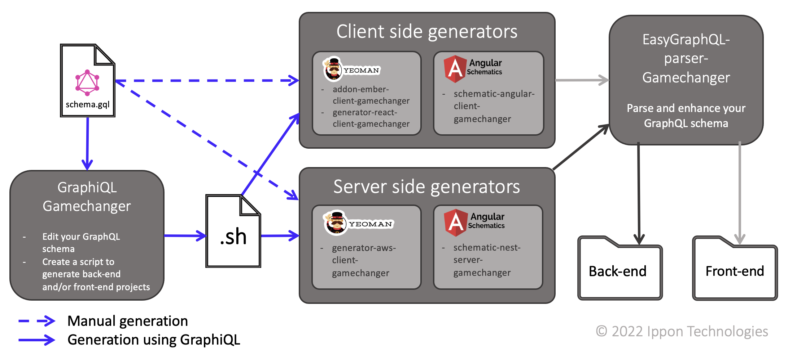

---
# the default layout is 'page'
order: 1
icon: fa fa-question-circle
title: What is GameChanger Cloud ?
---

&nbsp;&nbsp;&nbsp;&nbsp;&nbsp;GameChanger Cloud is a development platform which aims to quickly generate, develop, & deploy fully Cloud compliant applications & infrastructure, using GraphQL as entry point.
By using GameChanger Cloud, you can easily generate a full project, with both server and client sides, by simply passing 
a GraphQL schema to its graphiql interface and selecting which technologies to use for the client side.

Let us dive in the several repositories of GameChanger Cloud to better understand which technologies are available and which are their purposes.

The GameChanger Cloud organisation manages 8 repositories  which work together as so: 

&nbsp;&nbsp;&nbsp;&nbsp;&nbsp;Generation can be done manually or via the GraphiQL interface. In both cases, the entry point is a GraphQL file that specifies the different types of entities in the database as well as their attributes. In both cases of generation, the parser will be called by the generators to enrich the data in the GraphQL file.   
For a manual generation, the generators are directly used, which results in a project generation one by one. For a generation using GraphiQL, the GraphQL file is supplied to the GameChanger Cloud solution via a graphical interface named GraphiQL which, after receiving a choice of technologies, will generate a bash script. This script will then have to be executed by the user to call the Back-end and Front-end generators.

These projects can be grouped in five categories. The ones responsible for generating the client side, those reponsible for generating the server side, the graphiql, the parser and the [documentation](https://github.com/GameChangerCloud/gamechangercloud.github.io), responsible for this website. We will now take a look at the first four categories.

## Client side generators

&nbsp;&nbsp;&nbsp;&nbsp;&nbsp;Each repository of this category is a generator of a client side according to a certain front-end technology. As you can see, three of the most common and used front-end frameworks can be used to generate the client-side of your application: Ember, React and Angular. The naming of the latter is quite different from its peers as the technology used to generate its files is different. In fact, the project angular-client-gamechanger uses an Angular schematic while the two others use yeoman. This choice of change was made as the community supporting the yeoman generator technology seemd less and less active. 

However, only the one based on Angular is operational, as the others have to be refactored to use an Angular Schematic.

## Server side generators

&nbsp;&nbsp;&nbsp;&nbsp;&nbsp;As its name suggests, this category of generators is in charge of the server side of your application. Before, you could generate the server side of your application with a back-end based on AWS server. Now, the server side of your generated application is based according to NestJS, a back-end framework. The two server side use an AWS lambda as well as an RDS Base howerver the second is based on GraphQL and defines the GraphQL API using NestJS whereas the first also uses AWS for the API and is based on SQL. Finally, as it was the case for the client side, the naming is different for the two generator as they respectively use an Angular Schematic and Yeoman.  

## GraphiQL

&nbsp;&nbsp;&nbsp;&nbsp;&nbsp;The GameChanger Cloud GraphiQL is kind of a GraphQL Playground which also serve as the interface for generating your fullstack application. Once provided with a GraphQL schema and a choice for the client-side technology, it will generate a script that you will have to execute to generate your whole application.

## Parser

&nbsp;&nbsp;&nbsp;&nbsp;&nbsp;The repository easygraphql-parser-gamechanger is at the core of GameChanger Cloud. In fact, it defines the package responsible for interpreting the provided GraphQL schema, converting it into an array of types and enhancing this array with additionnal informations about the fields, the types and the relationships they have with each other.

